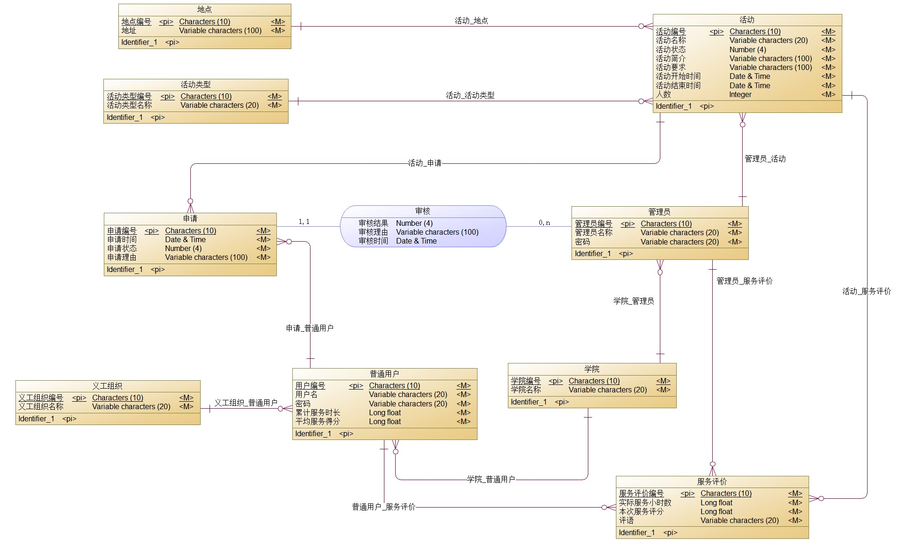
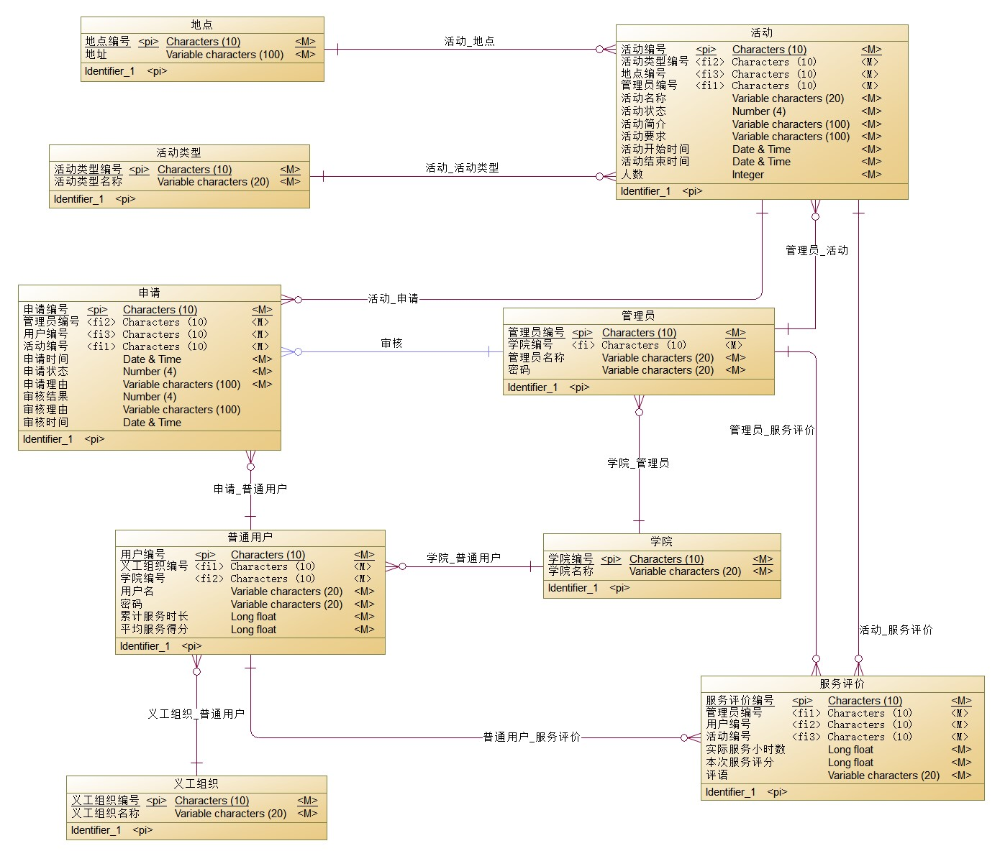
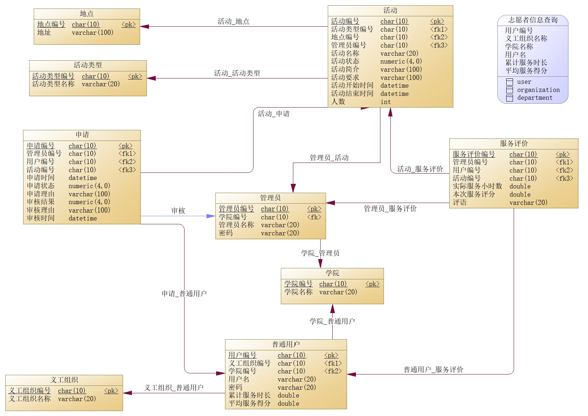
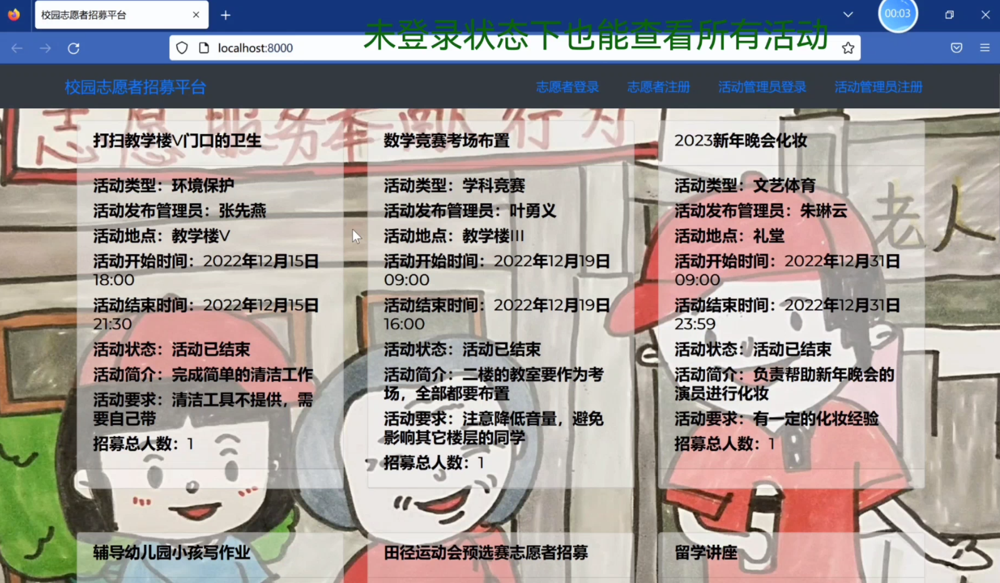
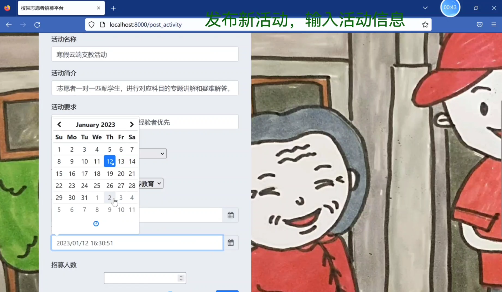
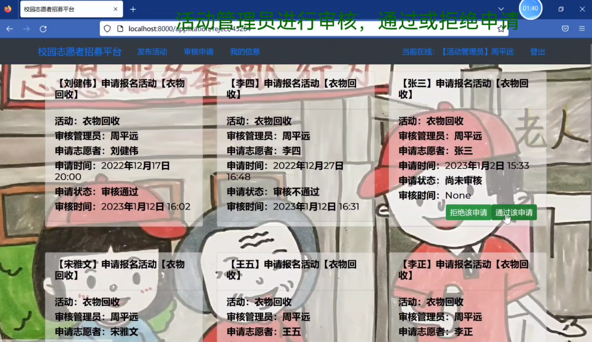

# 2022_HITSZ_DB-Lab4

校园志愿者招募平台的设计与实现

哈尔滨工业大学（深圳）2022年秋季学期《数据库系统》课程实验四

## 简介

本次实验的主要内容为设计并实现一个小型数据库系统，可选的题目有实验室管理平台、校园食堂外送点餐系统、校园猫管理平台、校园志愿者招募平台这4个。本人选择的题目是**校园志愿者招募平台**。本人该门课程**实验部分的成绩为满分**。

- [实验报告](./report.pdf)
- [包含字幕的系统介绍录屏（播放时间约2分钟）](./demo.mp4)

### CDM图

### LDM图

### PDM图

## 开发工具

- 数据库设计：PowerDesigner 16.5
- 数据库管理系统：MySQL Workbench 8.0
- 前后端交互编程语言：Python
- 前后端交互方案：使用Django搭建Web应用
- 前端开发所用的IDE：PyCharm 2022.2 (Community Edition)

## 所实现的功能

- 查看全部已有活动的信息（未登录、登录状态下均能进行）
- 活动管理员及志愿者的注册、登录、退出登录、查询个人信息功能
- 活动管理员发布新活动（包括时间、地点、人数、要求等信息），并观察到随之更新的活动列表
- 志愿者申请参加活动
- 管理员查询自己发布的活动的申请人清单，并对申请人进行审核（通过或拒绝申请）
- 志愿者查询申请结果（待审核、通过或拒绝），并能观察到之前提交的申请已经不再是“未审核”状态

## 效果展示

## 致谢

本项目在设计和实现的时候参考了[hewei2001](https://github.com/hewei2001)的[campus-canteen-ordering](https://github.com/hewei2001/campus-canteen-ordering)项目。感谢作者的贡献！